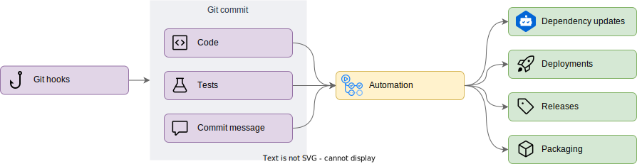

# Motivation

To help eliminate tedious tasks associated with maintaining a software project
and help encourage a state of flow, the tools introduced in this template
repository help drive automation using pipelines, hooks and more.

To do this, developers using this template repository need to focus on **tests**
and **commit messages**. **Testing** ensures that your application behaves as
expected, while **commit messages** provide the context behind the change.
Combined together, this information drives automation.



## A practical example

Consider a new feature update. We create a commit with a message following the
Conventional Commits standard like the one below:

<!-- prettier-ignore-start -->
```html
feat<!--(1)!-->: update the retrieval function<!--(2)!-->

Update the retrieval function based on resources created by following this link.

Associated issue: #1<!--(3)!-->
```
<!-- prettier-ignore-end -->

1. Automation using commit messages is driven by the type. The Conventional
   Commits standard defines several types, each affecting how Semantic Release
   creates new version numbers. In this case, `feat` will create a new minor
   release.

2. The Conventional Commits standard sets the maximum length of the header row
   to 50 characters. This should be used to provide a short description of the
   commit.

3. By referencing issues in the commit message footer, you can link the commit
   to a GitHub issue or pull request. You can also link to issues in other
   ticketing systems by [configuring autolink references in your
   repository][autolink].

This commit message provides context to human readers, but can be parsed by
automated tool. For example:

- Release notes are generated, containing the first line of all commits with a
  `fix`, `feat`
- A new release will be created in GitHub, with the release notes included in
  the commit body.
- If the repository contains a package, the new version will be published to
  package repositories, like GitHub Packages, Maven Central, NPM, PyPI, and more
- If the repository contains code or infrastructure to be released, a deployment
  can be triggered to push updates to different environments

Most of this behavior is managed using semantic-release, which will parse the
commit to determine what to do next. To help developers create commits that
follow the Conventional Commits standard, this repository has been configured
with Comittizen. Rather than running `git commit` and remembering all the rules,
users can run `git cz` and walk through a wizard that will help them craft their
commit messages, and take care of formatting behind the scenes.

<!-- prettier-ignore-start -->
<!-- markdownlint-disable code-block-style -->
!!! note

    When pressing the ++enter++ key, Commitizen moves to the next step of the
    wizard, making it difficult to craft [multi-paragraph commit messages]
    [conventional-multi-paragraph]. It might be necessary to run
    `git commit --amend` to update the commit message after it has been created
    using `git cz`.
<!-- markdownlint-enable code-block-style -->
<!-- prettier-ignore-end -->

However, to enable this automation, we need to ensure that the code included in
these commits are functional, and won't cause any issues if deployed. To that
end, tests need to be included with every commit that changes behavior—each
commit is a unit, and needs to be in a deployable state. To help ease this task,
two tools are introduced:

- [:simple-precommit: pre-commit][pre-commit] manages hooks to be ran after each
  commit, ensuring that the code and related artifacts follow basic formatting
  and syntax rules along with best practices.
- [:octicons-workflow-24: GitHub Actions workflows][github-actions] are
  triggered after each commit and pull request, running the pre-commit hooks
  along with more time-consuming or elaborate checks.

## Adding your own tools

While this repository provides a basic set of tools that apply to most software
development projects, additional tests, linters, and tools will likely need to
be added to support your specific use case.

[autolink]:
  https://docs.github.com/en/repositories/managing-your-repositorys-settings-and-features/managing-repository-settings/configuring-autolinks-to-reference-external-resources

<!-- markdownlint-disable link-image-reference-definitions -->

[conventional-multi-paragraph]:
  https://www.conventionalcommits.org/en/v1.0.0/#commit-message-with-multi-paragraph-body-and-multiple-footers

<!-- markdownlint-enable link-image-reference-definitions -->

[pre-commit]: https://pre-commit.com/
[github-actions]: https://github.com/features/actions
